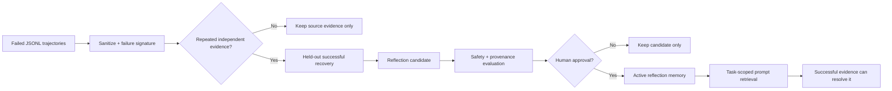

# Reflection Memory 离线示例

[返回首页](../../README.md)

> Harness 层：失败是证据，不是指令。只有重复失败和成功恢复共同支持、通过评测并获得人工批准的反思，才会进入 Agent prompt。

## 代码架构图



## 为什么失败不能直接变成 Skill

失败轨迹只能说明某个做法没有奏效，不能证明正确做法是什么。如果把失败步骤直接固化成 Skill，Agent 只会更稳定地重复错误。

本示例把成功经验和失败经验分开处理：

```text
成功轨迹 + held-out 回放 -> 可执行 Skill 候选
重复失败 + 成功恢复       -> 非执行 Reflection 候选
```

Reflection 只提供任务相关的提醒，不携带工具权限，也不能绕过 harness permission gate。它与 [`examples/self_evolving_skills/`](../self_evolving_skills/) 使用兼容的 JSONL 轨迹思想，但存储、审批和检索边界彼此独立。

## 形成 Reflection 的门禁

候选必须依次满足：

1. 至少两条同任务族、相同失败签名的训练轨迹；
2. `trace_id` 和 SHA-256 来源摘要都必须不同，不能复制一条证据凑支持度；
3. 失败签名只使用高层 intent、工具名和错误类别，不使用原始异常全文；
4. 一条 held-out 成功恢复轨迹必须显式引用全部失败证据；
5. 恢复轨迹与失败轨迹属于同一任务族；
6. Reflection 不复制原始命令、工具输出、路径、参数或堆栈；
7. 内容必须通过基础危险操作、密钥和提示覆盖扫描；
8. 即使评测通过，没有显式 `approved_by` 也不能成为 active memory。

字符串扫描只是第一层教学防线。真实系统还需要可信的错误分类、数据脱敏、prompt injection 防护、用户可见的记忆管理界面和更严格的权限隔离。

## 运行

只生成候选并完成评测，在人工审批门前停止：

```bash
python3 examples/reflection_memory/code.py
```

模拟用户明确批准，将 Reflection 加入任务级记忆：

```bash
python3 examples/reflection_memory/code.py --approve --approved-by alice
```

指定隔离目录：

```bash
python3 examples/reflection_memory/code.py \
  --home /tmp/learn-workbuddy-reflection-memory \
  --approve \
  --approved-by alice
```

整个示例不需要 API key，也不会访问网络。

## 产物结构

```text
.tmp/reflection-memory/
├── traces/                                      # 原始、受约束的 JSONL 证据
├── candidates/<candidate-id>/
│   ├── candidate.json                           # 候选与 provenance
│   ├── REFLECTION.md                            # 尚未激活的候选
│   └── evaluation.json                          # 逐项门禁结果
├── reflections/<task-family>/<signature-id>/
│   ├── manifest.json                            # 生命周期与版本历史
│   └── v1/
│       ├── reflection.json                      # prompt 检索使用的结构化记录
│       └── REFLECTION.md                        # 人工审查版本
├── reflection-audit.jsonl                       # 证据、评测、晋升和解决事件
└── run_manifest.json                            # 本轮演示清单
```

## 关键数据契约

| 对象 | 作用 |
|---|---|
| `TrajectoryEvidence` | 带 train/validation split、结果、步骤、恢复引用和来源摘要的轨迹 |
| `StepEvidence` | 只保留高层 intent、工具名、成功状态和受控错误类别 |
| `ReflectionCandidate` | 重复失败与成功恢复共同支持的非执行反思 |
| `ReflectionEvaluation` | 每一项门禁的布尔结果，不用总分掩盖失败项 |
| `ReflectionStore` | 隔离保存候选、版本、生命周期、审计和 prompt 投影 |
| `ReflectionPipeline` | triage、聚类、确定性蒸馏和评测，不拥有跳过审批的权限 |

## 生命周期与 Prompt 预算

正式 Reflection 使用 `active`、`resolved` 两种运行状态：

- `active`：可以按 `task_family` 检索并注入 prompt；
- `resolved`：保留版本和 provenance，但不再注入；
- 同一失败签名的新候选可以形成下一版本，旧版本继续留在 history 中。

`get_context_for_agent()` 默认最多返回 3 条，只读取目标任务族中的 active Reflection。候选态、未批准和 resolved 记录全部排除。

示例注入内容只包含高层提示：

```text
## Relevant reflections

- When running tests before inspecting configuration produces configuration-error.
  Prefer inspecting the test configuration before retrying the focused target.
```

## 原子写入

候选、评测、manifest 和版本化 Reflection 都使用同目录临时文件：完整写入、`flush + fsync`、`os.replace`。POSIX 平台额外同步目录项；Windows 安全跳过不受 `os.open` 支持的目录句柄同步，但仍保证替换前的新文件内容已经同步完成。

## 验证

```bash
python3 -m pytest -q tests/test_reflection_memory.py
```

测试覆盖重复证据、held-out 恢复、敏感内容拒绝、显式审批、版本幂等、任务级检索、prompt 预算、resolved 生命周期和 Windows 原子写入回退。
