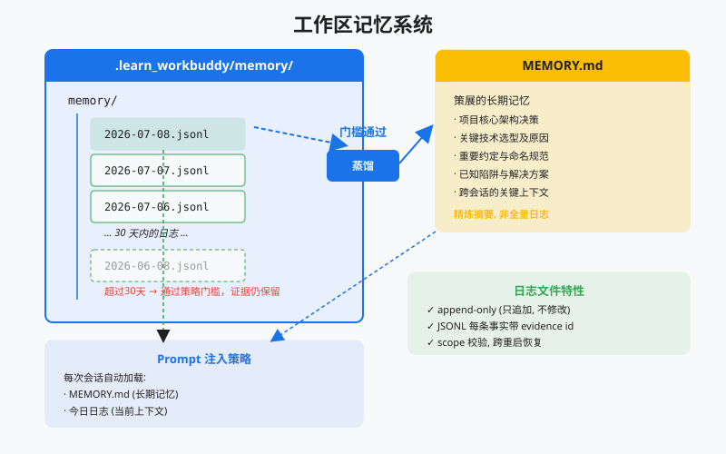
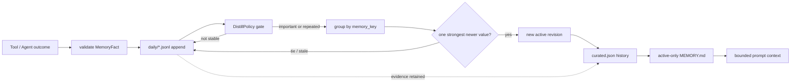
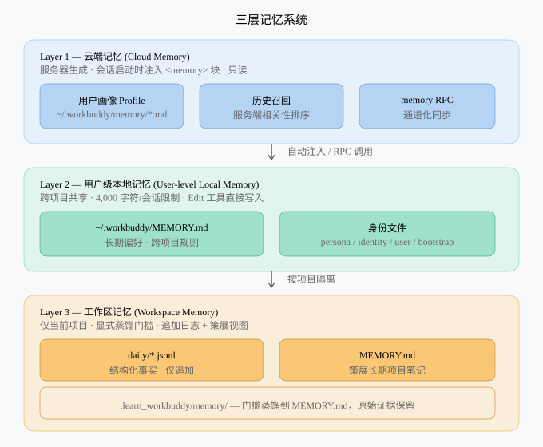

# s10: Workspace Memory — 从工作日志蒸馏可恢复的项目记忆

> Transcript 保存一次会话发生了什么；Workspace Memory 选择下次仍值得知道什么。
>
> **Harness 层**：项目作用域、记忆写入策略、蒸馏策略与 prompt 注入。



## 代码架构图



## 本章设计目标

s09 的 JSONL transcript 属于某个 session，是完整执行证据；本章不是复制一份聊天记录，而是建立项目级的选择性记忆：

- 同一项目的不同会话可以恢复同一份记忆；不同项目绝不串线。
- 原始事实只追加，蒸馏不会删除证据。
- 只有稳定、足够旧且重要或重复出现的事实进入长期视图。
- 可替换的项目决策使用显式 `memory_key` 形成冲突域，新值只会在重复确认且时间更新时替代旧值。
- 被替代的修订和原始证据继续保留，prompt 只注入每个冲突域的 active 修订。
- 策展状态通过原子替换更新，失败时仍保留上一份完整文件。
- 不依赖 API key 就能验证记忆策略。

这也是它相对 s09 的主要增量：**transcript 负责忠实记录，memory 负责有损选择。**

## 存储布局与所有权

```text
project/
└── .learn_workbuddy/
    └── memory/
        ├── daily/
        │   ├── 2026-08-07.jsonl
        │   └── 2026-08-08.jsonl
        ├── curated.json
        └── MEMORY.md
```

| 文件 | 身份 | 写入方式 | 能否作为证据 |
|---|---|---|---|
| `daily/*.jsonl` | 原始事实日志 | `O_APPEND` 单记录追加 | 是 |
| `curated.json` | 策展状态的机器真相 | 临时文件 + `os.replace` | 可追溯到 evidence id |
| `MEMORY.md` | 面向人和 prompt 的派生视图 | 从策展状态原子重建 | 否，随时可重建 |

教学实现使用 `.learn_workbuddy` 命名空间，避免练习代码碰到真实产品状态。`WorkspaceMemory` 会先解析项目绝对路径，再生成 `workspace_id`；日志和策展文件在读取时都校验该 id。

## 一条事实如何进入长期记忆

### 1. 记录结构化事实

`MemoryFact` 不接收一大段自由格式总结，而是要求明确字段：

```python
memory.append_daily_log(
    "SQLite must run in WAL mode.",
    kind=FactKind.DECISION,
    importance=5,
    memory_key="storage.sqlite.journal-mode",
    source="agent",
    evidence={"file": "storage.py"},
)
```

`kind` 只有四类：

| 类型 | 例子 | 默认是否可蒸馏 |
|---|---|---|
| `decision` | 选择 SQLite WAL | 是 |
| `convention` | 路径必须相对 workspace | 是 |
| `pitfall` | 不可把 token 写入记忆 | 是 |
| `outcome` | 本次测试通过 | 否，只留在近期日志 |

内容、重要度和类型在持久化之前验证。每个 JSON 对象编码为一行，再以一次 `os.write` 追加；成功返回前执行 `fsync`。

`memory_key` 是可选的、由 harness 或工具调用者显式提供的稳定冲突域，只允许小写单词以及 `.`、`_`、`-` 分隔符，例如 `runtime.python-version`。它描述“这条记忆回答哪个问题”，而不是答案本身：`Use Python 3.11` 和 `Use Python 3.12` 可以共享同一个 key。未设置该字段的旧调用继续使用内容派生 key，不会被升级过程猜测或合并。

### 2. 通过显式策略蒸馏

默认策略的逻辑是：

```text
年龄达到 30 天
AND 类型属于 decision / convention / pitfall
AND (importance >= 4 OR 规范化后重复出现 >= 2 次)
```

这套规则刻意不让 LLM 直接决定“什么值得永远记住”。生产系统可以在候选提取阶段使用模型，但保留条件、作用域和证据关系仍应由 harness 控制。

无 `memory_key` 的策展记忆仍由 `kind + 规范化内容` 生成稳定 key。显式 keyed 记忆则先按 `memory_key` 建立冲突域，再按以下规则处理：

1. 与 active 内容相同的新事实只合并 `evidence_ids`，不会产生新修订。
2. 不同内容必须同时通过普通晋升门槛，并至少有 `supersession_repeat_threshold` 条独立事实确认；默认值为 2，即单条高重要度事实也不能直接覆盖现有决策。
3. 候选的最新时间必须晚于 active 修订的 `last_seen`，过期证据不能回滚当前值。
4. 多个候选按重要度、独立证据数和最新时间排序；最优分数相同时 fail closed，保留当前修订并在报告中增加 `conflicts`。
5. 唯一胜出者成为下一版 active 修订；旧版标记为 `superseded`，双方通过 `supersedes` / `superseded_by` 互相指向。

每条修订都保留 `revision` 和 `evidence_ids`，因此重复运行 `distill` 是幂等的，完整决策历史也可审计。`DistillReport` 额外报告 `superseded`、`conflicts` 与 `stale`，让拒绝覆盖的原因可观察。

### 3. 保留原始证据

蒸馏是建立派生视图，不是日志清理：

```text
daily fact log ──select──> curated.json ──render──> MEMORY.md
       │                    │
       └──── retained ──────┘  evidence_ids
```

删除旧日志会让长期结论失去来源，也让错误蒸馏无法重新计算。真正的存储清理由单独的 retention/backup 策略负责，不和 memory distill 混在一起。

### 4. 原子更新与重启恢复

直接以 `"w"` 打开 `MEMORY.md`，进程崩溃时可能只剩半个文件。本章采用同目录临时文件：

1. 写入完整内容；
2. `flush + fsync`；
3. `os.replace` 原子替换目标；支持目录句柄的平台继续 `fsync` 所在目录，Windows 则安全跳过不受 `os.open` 支持的目录同步；
4. 失败时清理临时文件，旧版本保持不变。

Windows 的回退仍会在替换前完整写入、刷新并同步临时文件，再执行同目录 `os.replace`，因此不会把半个新文件暴露为 canonical state。POSIX 平台额外同步目录项，以加强断电后的 rename 持久性。

`curated.json` 是 canonical state，`MEMORY.md` 是可重建投影。如果进程在两次替换之间退出，下一次读取会以 canonical state 修复陈旧投影。新建一个 `WorkspaceMemory(project_dir)` 实例即可从磁盘恢复事实、策展条目和 prompt context；不会反序列化任何进程内对象。

当前 schema 为 v2；读取器仍接受 v1 daily fact 和 curated state。旧条目按无 key 的 legacy 语义恢复，在下一次成功蒸馏写入时统一保存为 v2，而不会自动推断冲突域。读取 keyed 状态时还会校验每个域恰好一个 active 修订、修订号连续、前后链接互相匹配；损坏状态会显式报错，不会静默选择一个答案。

## Prompt 注入边界

`get_context_for_agent()` 只注入两部分：

- 紧凑的 `MEMORY.md`；
- 最近最多 6 条 workspace facts。

它不会把所有 daily log 或 session transcript 整体塞回上下文。Keyed 原始事实在完成蒸馏前也不会作为 recent facts 绕过冲突策略；prompt 只能看到每个冲突域当前的 active 修订。Memory 的价值不在“存得越多”，而在召回时有明确预算和优先级。

`MemoryAwareAgent` 在每个模型回合前读取这个 bounded view，并提供结构化 `write_memory` 工具。是否继续工具循环由响应中的 `tool_use` block 决定，不依赖 provider 的某个 stop-reason 字符串。

## 主要代码流程

```text
append_daily_log
  -> validate kind / importance / content / optional memory_key
  -> attach workspace_id + fact_id + UTC timestamp
  -> append one JSONL record + fsync

distill
  -> load facts older than cutoff
  -> reject unstable kinds
  -> preserve legacy content groups; group keyed facts by conflict domain
  -> apply importance/repetition gate
  -> reject stale or tied challengers
  -> merge evidence or append a linked revision
  -> atomically replace curated.json and MEMORY.md

restart
  -> resolve the same project scope
  -> validate workspace_id and schema
  -> reload daily facts + curated state
  -> rebuild bounded prompt context
```

## 离线运行与验证

所有章节通用的无 key 演示：

```bash
python3 s10_workspace_memory/code.py --demo
```

只运行本章行为测试：

```bash
python3 -m pytest -q tests/test_workspace_memory.py
```

测试覆盖：项目隔离、追加顺序、蒸馏门槛、幂等、证据保留、原子替换失败、key 校验、新值确认、冲突 fail closed、过期证据防回滚、修订链校验、v1 迁移和跨实例恢复。

配置模型后可运行交互路径：

```bash
python3 s10_workspace_memory/code.py
```

## 三层记忆中的位置



工作区记忆属于当前项目；s11 才会处理跨项目的用户偏好，s12 再讨论远端 profile/recall。三层不能只按“文件放在哪里”区分，更重要的是 owner、写入权限、保留策略和召回时机不同。

## 常见误区

- **把 transcript 当 memory**：完整轨迹会迅速挤满上下文。
- **模型说重要就永久保存**：缺少 harness gate，记忆会被猜测和提示注入污染。
- **蒸馏后删除日志**：丢失证据，无法重算和审计。
- **直接覆盖策展文件**：崩溃可能损坏长期状态。
- **只按字符串路径隔离**：相对路径、软链接可能让同一项目得到多个 scope。
- **把一次测试通过写成长期规则**：outcome 应留在近期日志，不自动晋升。
- **用答案文本充当 `memory_key`**：值改变时会变成另一个冲突域，失去替代关系；key 应描述稳定问题，例如 `runtime.python-version`。
- **让单条新事实覆盖已有决策**：高重要度不等于已确认，替代必须满足独立重复证据门槛。
- **把所有候选都注入 prompt 再让模型选择**：这会绕过 harness 的冲突策略；未决候选应留在证据日志中。

## 练习

1. 为 `DistillPolicy` 增加来源置信度，让用户确认的事实比工具推断更容易晋升。
2. 为冲突报告增加待人工裁决队列，并设计显式选择某个候选的审计记录。
3. 在不加载全部日志的前提下实现按日期倒序读取最近事实。

## 下一课

s11 将 owner 从 workspace 提升到 user：偏好需要跨项目复用，同时必须去重并避免项目规则污染全局画像。
