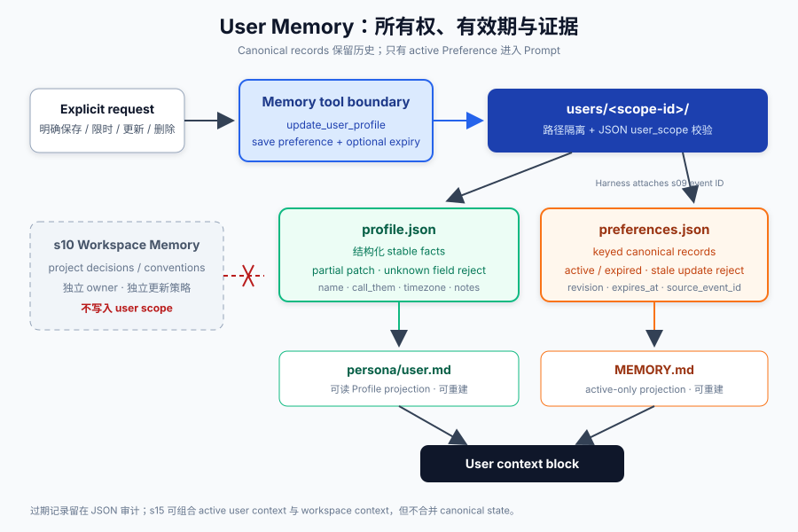
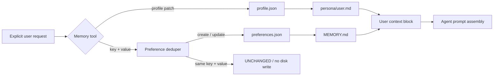

# s11: User Memory — Profile 与 Preference 的用户级边界

> 工作区记忆回答“这个项目长期有效的事实是什么”；用户记忆回答“这个人跨项目仍然有效的稳定信息与明确偏好是什么”。
>
> **Harness 层**：Memory ownership、显式状态变更与 Prompt context。

---



## 本章解决什么问题

s10 已经能把项目决策、约定和踩坑经验蒸馏成工作区记忆，但以下信息不属于任何项目：

- 用户希望被如何称呼；
- 用户所在时区；
- 所有项目都使用中文回复；
- 默认采用简洁说明；
- 编辑器统一使用 tabs。

如果把这些内容写进每个项目，会产生复制、漂移和跨用户污染。如果把对话中出现过的所有描述直接追加到一个 `MEMORY.md`，同一个偏好更新后又会同时存在新旧版本。

本章把用户记忆设计成两个不同的契约：

| 类型 | 回答的问题 | 更新方式 | 例子 |
|---|---|---|---|
| Profile | “这个用户是谁？” | 显式字段 patch | `name`、`call_them`、`timezone` |
| Preference | “跨项目默认怎样做？” | 按稳定 key 创建、替换或删除 | `response.language=Chinese` |

两者都属于用户作用域，但不能混成任意 Markdown：Profile 需要字段级更新，Preference 需要冲突替换和幂等重试。

## 设计目标

本章的核心不是“多存一个文件”，而是让 Harness 能回答五个问题：

1. **Owner 是谁？** 每份状态都带稳定 `user_scope`，同一根目录可安全承载多个用户。
2. **写入是否明确？** 只有 `update_user_profile` 和 `save_user_preference` 等显式工具能改变状态。
3. **重复调用会怎样？** 相同 key/value 是 no-op，不增长文件、不增加 revision。
4. **偏好变化会怎样？** 相同 key 的新 value 替换旧 value，Prompt 中不会同时出现冲突规则。
5. **进程重启后信谁？** JSON 是 canonical state，Markdown 只是可读与 Prompt-facing projection，可从 JSON 修复。

## 代码架构图



这里有一条重要边界：`UserMemory` 不接收 workspace path，也不读取 s10 的日志。用户上下文和工作区上下文可以在 s15 组装 Prompt 时合并，但存储、更新策略和所有权仍然分开。

## 存储结构

教学实现默认写入 `~/.learn_workbuddy/user-memory/`，不会碰真实产品目录：

```text
~/.learn_workbuddy/user-memory/
└── users/
    └── <scope-id>/
        ├── profile.json
        ├── preferences.json
        ├── MEMORY.md
        └── persona/
            ├── core.md
            ├── identity.md
            ├── user.md
            └── bootstrap.md
```

`scope-id` 是规范化用户标识的稳定摘要。它有两个作用：

- 任意账号标识不会直接成为路径，避免 `/`、空格或邮箱出现在目录结构中；
- canonical JSON 再保存同一个 `user_scope`，即使文件被错误复制到另一个用户目录，也会在读取时拒绝，而不是静默注入错误用户的 Prompt。

### Canonical state 与 projection

| 文件 | 角色 | 是否作为真相来源 |
|---|---|---|
| `profile.json` | 结构化用户资料 | 是 |
| `preferences.json` | 带 key、revision、source 的偏好集合 | 是 |
| `persona/user.md` | 便于人阅读的 Profile 投影 | 否，可重建 |
| `MEMORY.md` | 便于检查和注入 Prompt 的 Preference 投影 | 否，可重建 |
| `persona/core.md` | 助手价值与边界 | 独立的 assistant identity |
| `persona/identity.md` | 助手名字、类型、emoji | 独立的 assistant identity |
| `persona/bootstrap.md` | 一次性引导说明 | 完成后删除 |

这种设计避免了 Markdown 同时承担数据库、编辑协议和 Prompt 三种职责。人可以查看 Markdown，代码用 JSON 完成确定性更新；投影损坏时，由 canonical state 恢复。

## 主要代码流程

### 1. Profile：显式 partial update

```python
result = memory.update_profile({
    "name": "老王",
    "call_them": "王哥",
    "timezone": "UTC+8",
})
```

更新规则：

- 只修改请求中出现的字段，未出现字段保持不变；
- `None` 表示明确删除某字段；
- 不在 schema 中的字段直接报错，避免模型每轮发明新字段；
- 相同值计入 `unchanged`，不重写文件；
- 改动发生时原子替换 `profile.json`，再刷新 `persona/user.md`。

Profile 不是从聊天内容自动抽取的“画像”。只有用户明确提供或明确要求保存的信息才进入这一层。

### 2. Preference：按语义 key 去重

```python
created = memory.set_preference("response.language", "Chinese")
unchanged = memory.set_preference("response.language", "Chinese")
updated = memory.set_preference("response.language", "English")
```

三次调用分别返回：

```text
CREATED   revision=1  previous=None     current=Chinese
UNCHANGED revision=1  previous=Chinese  current=Chinese
UPDATED   revision=2  previous=Chinese  current=English
```

去重不能只比较整段文本。例如“回复使用中文”和“以后回复使用英文”不是两条并存的长期事实，而是同一个 `response.language` 偏好的两个版本。稳定 key 提供冲突域，value 表示当前状态。

### 3. 显式删除

```python
memory.delete_preference("response.language")
```

删除按 key 精确执行，不对自然语言做模糊匹配。Harness 因此可以向用户展示将删除的具体偏好，也能在审计日志中记录明确目标。

### 4. 多用户隔离

```python
alice = UserMemory(root, user_id="alice")
bob = UserMemory(root, user_id="bob")

alice.set_preference("editor.indent", "tabs")
bob.set_preference("editor.indent", "spaces")
```

两者共享状态根目录，但落入不同 `scope-id`。读取时还会校验 JSON 内部的 `user_scope`：路径隔离负责正常路由，scope marker 负责发现错误复制或调用方传错用户。

### 5. Prompt context

```text
## Assistant values
...

## Assistant identity
...

## User profile
Name: 老王
Timezone: UTC+8

## Explicit user preferences (cross-project)
- `response.language`: Chinese
```

这一块只包含用户所有的上下文。项目决策不会被写入这里；s15 可以根据当前会话分别加载 user context 和 workspace context，再决定顺序、预算和覆盖策略。

## 为什么不能自动记住每句话

长期记忆会进入未来 Prompt。自动把聊天内容提升为用户事实会带来三个问题：

- **误归因**：用户引用别人的观点，不代表那是用户偏好；
- **时效不明**：一次性要求可能被错误升级为永久规则；
- **不可解释**：调用方无法说明某条记忆为何产生，也难以提供撤销入口。

因此本章采用保守策略：模型可以建议调用记忆工具，但系统提示要求只有在用户明确表达长期意图时才能写入。真正的生产 Harness 还可以在工具执行前增加 ASK 权限、审计和可视化确认。

## 与 s10、s12 的边界

| 层 | Owner | 内容 | 典型读取时机 |
|---|---|---|---|
| s10 Workspace Memory | workspace | 项目决策、约定、踩坑 | 进入对应项目时 |
| s11 User Memory | user | 稳定 Profile、明确跨项目偏好 | 用户会话启动时 |
| s12 Remote Recall | remote account/service | 长期历史候选与远端 Profile | 当前 query 需要时 |

它们可以在最终 Prompt 中同时出现，但不能共用一个无作用域的 `MEMORY.md`。存储层先保证所有权正确，检索与 Prompt assembly 再决定本轮使用哪些内容。

## 原子写与重启恢复

Profile 与 Preference 都会经历：

```text
validate -> serialize -> write temp file -> fsync -> os.replace
```

如果写临时文件时进程失败，旧 canonical file 仍然存在；成功替换后，不会留下“写了一半的 JSON”。新进程重新创建 `UserMemory(root, user_id=...)` 即可恢复状态，不依赖内存缓存。

`MEMORY.md` 被人工改坏或处于旧版本时，`read_memory()` 会根据 `preferences.json` 重新生成投影。这体现了 Harness 中常见的原则：可读视图可以修复，canonical state 必须有清晰边界。

## 离线验证

本章测试覆盖：

- Profile partial update、删除和跨重启读取；
- Preference create/update/unchanged revision 语义；
- 同 key 只保留当前值；
- 两个用户共享 root 时仍然隔离；
- 错误复制的跨 scope JSON 被拒绝；
- Prompt context 不包含 workspace state；
- `MEMORY.md` 可从 canonical preferences 修复。

运行：

```bash
python3 -m pytest -q tests/test_user_memory.py
python3 scripts/verify.py
```

## 运行教学示例

离线查看本章在学习路径中新增的契约：

```bash
python s11_user_memory/code.py --demo
```

运行交互式模型示例：

```bash
MODEL_ID=<model> ANTHROPIC_API_KEY=<key> python s11_user_memory/code.py
```

可通过环境变量切换本地教学用户和状态根目录：

```bash
WORKBUDDY_USER_ID=alice \
WORKBUDDY_HOME=/tmp/learn-workbuddy \
python s11_user_memory/code.py
```

## 练习

1. 给 `set_preference` 增加可选的 `expires_at`，让临时跨项目偏好自动失效。
2. 在不改变存储所有权的前提下，为 Preference 增加来源事件 ID，连接 s09 transcript 证据。
3. 在 s15 Prompt assembly 中实现明确的优先级：本轮用户指令 > workspace override > user default。

## 下一课

s11 已经定义“存下来的用户状态是什么”。s12 将继续区分 stored memory 与 recalled context：远端长期历史不是全部注入 Prompt，而是按当前 query 返回带 source 和 score 的候选视图。
