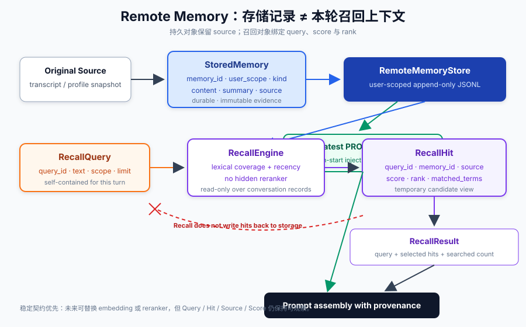
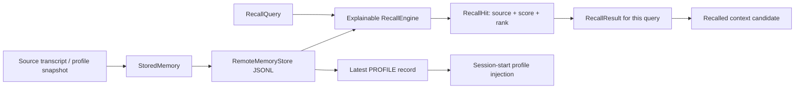

# s12: Remote Memory — Stored Record 与 Recalled Context

> Memory 是带 owner 和 source 的持久记录；Recall 是针对当前 query 生成的候选视图。两者生命周期、可信度和使用方式不同。
>
> **Harness 层**：Remote memory boundary、retrieval contract 与 context provenance。

---



## 本章解决什么问题

s10 和 s11 已经分别定义了 Workspace Memory 与 User Memory。它们解决“把什么状态持久化到哪里”，但还没有回答长时间跨度下的另一个问题：

> 当前任务需要过去哪一段信息？

一个常见错误是把“数据库里存过的所有记忆”和“本轮应该进入 Prompt 的上下文”都叫 memory。这样会掩盖关键边界：

- 存储记录必须长期存在，并能说明属于谁、来自哪里；
- 召回结果只对某个 query 有意义，换一个 query，排名和结果都可能变化；
- 检索命中不等于事实正确，也不等于必须进入 Prompt；
- 召回不应因为读到了某条记录，就把它重新写成一条新记忆。

本章将这条链路拆成四个可观察对象：

```text
StoredMemory -> RecallQuery -> RecallHit -> RecallResult
```

## 代码架构图



图中有两条不同路径：

- 最新 Profile snapshot 在会话启动时加载，并保留 `memory_id`、`source_id`、`captured_at`；
- Conversation records 只在模型明确调用 `recall_history` 时参与召回，形成当前 query 的 hits。

Profile 不是 history hit，history hit 也不会被自动保存成 Profile。

## 核心数据契约

### StoredMemory：持久记录

```python
@dataclass(frozen=True)
class StoredMemory:
    memory_id: str
    user_scope: str
    kind: MemoryKind
    content: str
    summary: str
    source: MemorySource
    stored_at: str
```

`StoredMemory` 是远端服务中的 durable evidence。它必须有稳定 ID、用户作用域和来源。教学实现使用追加式 JSONL 模拟远端服务，进程重启后可重新读取。

### MemorySource：来源

```python
@dataclass(frozen=True)
class MemorySource:
    source_id: str
    source_type: str
    title: str
    captured_at: str
```

`source_id` 指向产生记录的原始对象，例如 transcript 或 profile snapshot。`stored_at` 表示记录何时进入存储，`captured_at` 表示来源事件发生的时间，两者不能混为一个字段。

### RecallQuery：本轮检索请求

```python
@dataclass(frozen=True)
class RecallQuery:
    query_id: str
    text: str
    user_scope: str
    limit: int
    issued_at: str
```

召回服务看不到当前聊天，因此 `text` 必须自包含：说明要找什么历史信息，而不是只写“继续上次”。`query_id` 把所有 hits 绑定到同一次检索，便于工具结果、审计和 Prompt context 对齐。

### RecallHit：候选视图

```python
@dataclass(frozen=True)
class RecallHit:
    query_id: str
    memory_id: str
    rank: int
    snippet: str
    source: MemorySource
    score: float
    matched_terms: tuple[str, ...]
```

`RecallHit` 不是复制出来的新记忆。它只是某条 `StoredMemory` 针对当前 query 的检索投影，包含本次 score、rank 和 matched terms。再次查询时，这些字段可以完全不同。

## 主要代码流程

### 1. Store：写入带来源的远端记录

```python
store.append(
    kind=MemoryKind.CONVERSATION,
    memory_id="memory-42",
    content="Selected SQLite WAL for local persistence.",
    summary="Selected SQLite WAL.",
    source=MemorySource(
        source_id="transcript-42",
        source_type="conversation_transcript",
        title="Persistence decision",
        captured_at="2026-08-01T12:00:00Z",
    ),
)
```

写入前会验证内容和重复 `memory_id`，并把 `user_scope` 写进每条 JSONL 记录。读取时 scope 不一致会失败，避免远端历史跨用户泄漏。

### 2. Query：构造一次自包含检索

```python
result = RecallEngine(store).recall(
    "continue the previous layered memory design",
    limit=5,
)
```

RecallEngine 为本次调用创建 `RecallQuery`。它不会访问 Agent 当前 messages，因此工具描述明确要求模型重述历史主题。

### 3. Retrieve：生成可解释 hits

教学 ranker 使用一个透明的离线基线：

```text
score = 0.85 * query-term coverage + 0.15 * recency
```

英文使用单词 token，连续中文增加二元字符特征。没有 lexical overlap 的记录不会产生 hit。分数相同时再按来源时间和 `memory_id` 稳定排序。

这个公式不是对生产检索实现的描述，而是为了让课程可以离线测试：读者能直接解释一条记录为什么命中、为什么排在另一条之前。

### 4. Result：返回结构化工具结果

`recall_history` 返回 JSON，而不是预先排版的 Markdown：

```json
{
  "query": {
    "query_id": "...",
    "text": "continue the layered memory design",
    "user_scope": "...",
    "limit": 5
  },
  "hits": [
    {
      "memory_id": "conversation-003",
      "rank": 1,
      "source": {"source_id": "transcript-conversation-003"},
      "score": 0.63,
      "matched_terms": ["memory"]
    }
  ],
  "searched_records": 6
}
```

结构化结果让 Harness 可以记录审计、显示来源、根据 Context budget 截断，或在后续版本中插入 reranker，而不必再解析人类文本。

### 5. Context：只渲染选中的候选

```xml
<recalled_context query_id="query-1" query="layered memory design">
  <hit rank="1" score="0.630000"
       memory_id="conversation-003"
       source_id="transcript-conversation-003">
    Separated workspace, user and remote memory boundaries.
  </hit>
</recalled_context>
```

即使进入 Prompt，hit 仍保留 query、source 和 score。模型看到的是“本轮召回候选”，而不是没有来源的事实段落。

## Profile 为什么单独加载

Remote Profile 也是一种 stored record，但选择策略不同：

- Profile 是某个时间点的服务端快照；
- 会话启动时只选最新 snapshot；
- Profile 保留来源元数据，不伪装成 s11 用户显式偏好；
- Profile records 不参加 conversation recall；
- 历史 conversation hits 也不会自动覆盖 Profile。

系统提示中的 Profile block 因此包含 provenance：

```xml
<remote_profile memory_id="profile-001"
                source_id="profile-snapshot-001"
                captured_at="...">
  ...profile content...
</remote_profile>
```

这比匿名 `<memory>` 文本更容易解释：调用方能知道注入了哪一个 snapshot，以及它何时产生。

## 为什么今天不加复杂 reranker

当前章节要先稳定的是接口，而不是追求更花哨的召回分数：

```text
query -> candidates -> source-bearing hits -> context
```

如果现在同时加入 embedding、hybrid search、LLM reranker、时间过滤和反馈学习，读者很难判断问题发生在召回、排序还是 Prompt 注入。保持 ranker 简单，可以先验证：

- query 是否自包含；
- hit 是否绑定正确 query；
- source 是否完整；
- score 是否可观察；
- limit 和 scope 是否生效；
- recall 是否保持只读。

以后替换 ranker 时，只要仍返回同一个 `RecallResult` 契约，上层 Agent tool 和 Prompt assembly 不需要重写。

## 与 s09、s10、s11 的边界

| 模块 | Owner | 核心对象 | 回答的问题 |
|---|---|---|---|
| s09 Transcript | session | event evidence | 这一轮真实发生了什么？ |
| s10 Workspace Memory | workspace | durable project facts | 这个项目长期有效什么？ |
| s11 User Memory | user | profile + explicit preferences | 这个用户跨项目默认怎样？ |
| s12 Remote Memory | remote user/service | stored records + recall hits | 当前问题需要哪段长期历史？ |

s09 transcript 可以成为 s12 StoredMemory 的 source，但“有 transcript”不等于“必须召回”。s12 负责把大量长期记录变成本轮少量候选。

## 失败与边界行为

- 空 query 或没有可检索 token：拒绝调用；
- `limit` 不在 1 到 10：拒绝调用；
- 重复 `memory_id`：拒绝写入；
- JSONL 中的 `user_scope` 不匹配：拒绝读取；
- 没有匹配：返回带 query 的空 `hits`，不是伪造低质量结果；
- Recall 多次执行：不会改变 durable store；
- Profile snapshot：只用于 profile selection，不混入 conversation hits。

## 离线验证

新增测试覆盖：

- StoredMemory 的 source provenance 和跨重启读取；
- Query、Hit、Source、Score、Rank 的结构化契约；
- Recall 是只读派生视图，不会追加存储；
- 最新 Profile 注入与 conversation recall 隔离；
- 跨用户 scope 文件拒绝；
- Prompt context 保留 query/source/score；
- 工具输出是结构化 JSON，而非预格式化历史文本。

运行：

```bash
python3 -m pytest -q tests/test_remote_memory.py
python3 scripts/verify.py
```

离线查看章节能力增量：

```bash
python s12_cloud_memory/code.py --demo
```

模型交互示例：

```bash
MODEL_ID=<model> ANTHROPIC_API_KEY=<key> python s12_cloud_memory/code.py
```

教学状态默认写入 `~/.learn_workbuddy/remote-memory/`。可以设置 `WORKBUDDY_HOME` 和 `WORKBUDDY_USER_ID` 隔离运行目录与用户作用域。

## 面试表达

我把远端记忆的存储模型和召回模型拆开了：StoredMemory 是带用户作用域和原始 source 的持久记录，RecallHit 是绑定某次 query 的临时候选，包含 score、rank 和 matched terms。召回过程只读，不会把命中结果重新写成记忆；Profile 快照与 conversation history 使用不同选择策略。这样后续接 embedding 或 reranker 时，查询、来源、结果和 Prompt context 的 Harness 契约仍然稳定。

## 下一课

s12 已经把大量远端记录压缩成少量、带来源的 recall hits。工具本身仍可能返回很大的内容；s13 将处理大输出外部化，让 Prompt 中保留指针而不是完整结果。
